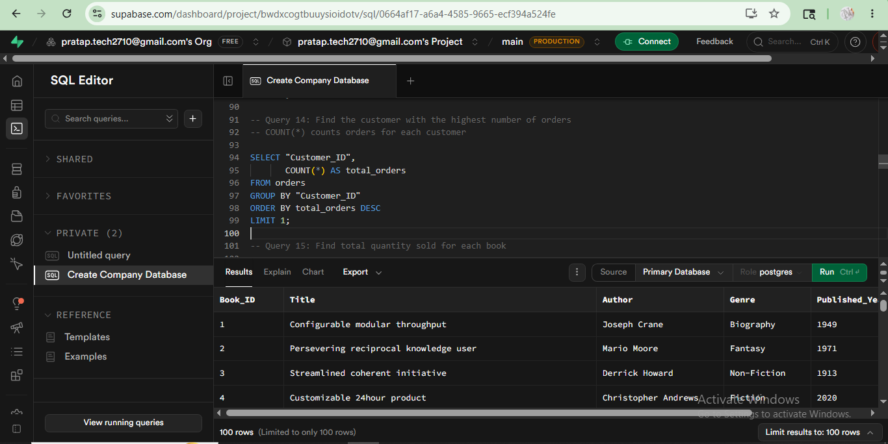

# 📚 Online Bookstore SQL Project

## 📖 Project Overview

The Online Bookstore SQL Project is a relational database analysis project built using PostgreSQL and Supabase. The project demonstrates database design, data import, data management, and analytical SQL querying using bookstore datasets containing information about books, customers, and orders.

The primary objective is to extract meaningful business insights related to sales performance, customer behavior, inventory management, and revenue generation through SQL-based analysis.

---

## 🎯 Project Objectives

* Design and implement a relational database schema.
* Import and manage structured bookstore datasets.
* Perform data analysis using SQL queries.
* Analyze sales trends and customer purchasing behavior.
* Generate business insights through aggregations and joins.
* Practice real-world SQL concepts used in data analytics.

---

## 🛠️ Technologies Used

* PostgreSQL
* Supabase
* SQL
* Git
* GitHub

---

## 🗂️ Database Schema

### 📚 Books Table

| Column         | Description                     |
| -------------- | ------------------------------- |
| Book_ID        | Unique identifier for each book |
| Title          | Name of the book                |
| Author         | Author of the book              |
| Genre          | Book category                   |
| Published_Year | Publication year                |
| Price          | Selling price                   |
| Stock          | Available inventory             |

### 👥 Customers Table

| Column      | Description                |
| ----------- | -------------------------- |
| Customer_ID | Unique customer identifier |
| Name        | Customer name              |
| Email       | Email address              |
| Phone       | Contact number             |
| City        | Customer city              |
| Country     | Customer country           |

### 🛒 Orders Table

| Column       | Description               |
| ------------ | ------------------------- |
| Order_ID     | Unique order identifier   |
| Customer_ID  | Reference to customer     |
| Book_ID      | Reference to book         |
| Order_Date   | Date of purchase          |
| Quantity     | Number of books purchased |
| Total_Amount | Total order value         |

---

## 📊 SQL Concepts Implemented

* SELECT Statements
* WHERE Clause
* ORDER BY
* DISTINCT
* Aggregate Functions

  * COUNT()
  * SUM()
  * AVG()
  * MIN()
  * MAX()
* GROUP BY
* HAVING
* INNER JOIN
* Data Filtering
* Sorting and Ranking
* Business Analytics Queries

---

## 📈 Business Questions Solved

* Which books generate the highest sales?
* Which customers spend the most money?
* What is the total revenue generated?
* Which books have the lowest inventory?
* What are the top-selling books?
* Which customers place the highest number of orders?
* What is the average book price?
* Which genres are most represented in the bookstore?

---

## 📸 Project Screenshots

### SQL Query Results

This screenshot shows the execution of SQL queries and the generated results in Supabase SQL Editor.



---

## 📂 Project Structure

```text
online-bookstore-sql-project/
│
├── Dataset/
│   ├── Books.csv
│   ├── Customers.csv
│   └── Orders.csv
│
├── queries.sql
├── schema.sql
├── Screenshots/
└── README.md
```

---

## 🚀 Key Insights Generated

* Identified top-performing books based on sales quantity.
* Calculated overall bookstore revenue.
* Determined highest-spending customers.
* Analyzed customer purchasing patterns.
* Evaluated inventory availability and stock levels.
* Generated revenue reports using SQL aggregations.

---

## 📚 Learning Outcomes

Through this project, I gained practical experience in:

* Relational Database Design
* Data Import and Cleaning
* SQL Query Development
* Aggregation and Grouping Techniques
* Table Relationships and Joins
* Business Data Analysis
* GitHub Project Documentation

---

## 👨‍💻 Author

**Navneet Pratap**

Aspiring Software Engineer | SQL Developer | Data Analytics Enthusiast

GitHub: https://github.com/Navneet-pratap1027
